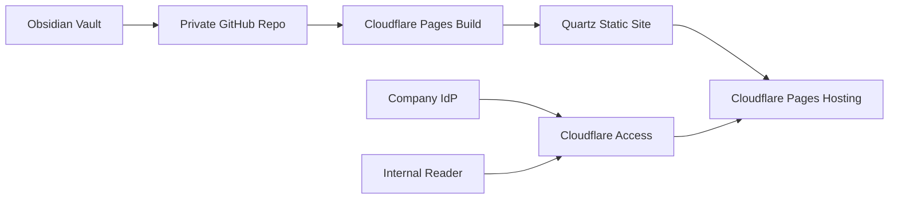

# PRD - Clesen Knowledge Base

## 1. Overview

### Product Summary

Clesen Knowledge Base publishes a private Obsidian vault as an SSO-protected static website for internal readers. The product keeps Obsidian and GitHub as the authoring/source workflow while giving readers a clean browser-based documentation experience. Readers do not need GitHub access or Cloudflare accounts.

### Objective

This PRD covers the MVP: a Quartz-powered static site deployed to Cloudflare Pages and protected by Cloudflare Access. The MVP proves the access model, publishing workflow, note filtering, attachment handling, search, and reader experience for a small pilot content set.

### Market Differentiation

The implementation must preserve the vault as the source of truth while decoupling reader access from GitHub permissions. The differentiator is not custom software complexity; it is the clean integration of Obsidian-native static publishing with edge-based SSO.

### Magic Moment

The magic moment is when an internal user opens the wiki URL, passes existing SSO, searches a topic, and reaches a useful linked note in under 30 seconds. The implementation must make authentication, search, and internal navigation fast and unsurprising.

### Success Criteria

- Pilot users can access the site without GitHub permissions.
- Cloudflare Access protects both the production Pages URL and any custom domain.
- Build output includes only approved notes and attachments.
- Search index excludes drafts, private folders, and unpublished notes.
- A representative note set renders wikilinks, callouts, images, tags, and backlinks correctly.

## 2. Technical Architecture

### Architecture Overview



### Chosen Stack

| Layer | Choice | Rationale |
| --- | --- | --- |
| Frontend | Quartz | Obsidian-native static publishing with wikilinks, backlinks, graph, search, tags, and callouts. |
| Backend | Cloudflare Pages | Static hosting and build pipeline; no app server required. |
| Database | None | Markdown and assets live in the private GitHub repo. |
| Auth | Cloudflare Access with company SSO | Protects the static site without GitHub access for readers. |
| Payments | None | Internal tool; no monetization. |

### Stack Integration Guide

Set up Quartz in the repository and configure it to read the vault content path. Use an explicit publishing rule, preferably `publish: true` frontmatter or a dedicated published folder. Configure Cloudflare Pages to build from the private GitHub repo. Protect the resulting `*.pages.dev` hostname with Cloudflare Access before pilot testing.

Required configuration:

- Cloudflare Pages project connected to private GitHub repo.
- Build command: `npm run build` or the Quartz equivalent configured in `package.json`.
- Output directory: Quartz-generated public output directory.
- Cloudflare Access application for the Pages hostname.
- IdP integration with the company SSO provider.
- Access policy based on an IdP group or company email domain.

### Repository Structure

```text
project-root/
  content/                  # Published Obsidian notes or filtered copy
  attachments/              # Published assets if separated from notes
  quartz.config.ts          # Quartz configuration
  quartz.layout.ts          # Layout customization
  package.json              # Build scripts
  docs/
    product-vision.md
    prd.md
    product-roadmap.md
  scripts/
    check-publish-scope.js  # Optional build guard for private content
    check-links.js          # Optional broken-link check
```

If the existing vault is at repository root, adapt paths so Quartz reads the correct content directory and excludes `private`, `.drafts`, templates, and other non-published material.

### Infrastructure & Deployment

Deploy through Cloudflare Pages. Start with the default `https://your-project.pages.dev` URL. If an internal subdomain is desired, add `wiki.company.com` as a Pages custom domain and create a CNAME at the existing DNS provider pointing to the Pages target. The whole DNS zone does not need to move to Cloudflare for a subdomain approach.

### Security Considerations

Cloudflare Access must protect the production hostname before the pilot. Preview deployments should also be protected or disabled for sensitive content. The build must fail if private folders, `publish: false` notes, or secrets are included in the output. Access policy should prefer an IdP group such as `Internal Wiki Readers` over a broad domain rule once the pilot expands.

### Cost Estimate

At pilot scale, Cloudflare Pages and Quartz are expected to be low or no cost depending on the organization's Cloudflare plan and Access requirements. GitHub private repository costs depend on the existing GitHub plan. The main cost is administrative: IT time to confirm SSO policy and DNS/CNAME approval if used.

## 3. Data Model

### Entity Definitions

There is no runtime database. The static data model is file-based:

```typescript
type Note = {
  path: string
  title: string
  frontmatter: {
    publish?: boolean
    tags?: string[]
    aliases?: string[]
    created?: string
    updated?: string
  }
  markdownBody: string
  outboundLinks: string[]
  attachments: string[]
}
```

```typescript
type Attachment = {
  sourcePath: string
  outputPath: string
  referencedBy: string[]
}
```

### Relationships

Notes link to other notes through wikilinks and Markdown links. Notes reference attachments by relative paths or Obsidian embed syntax. Tags group notes for navigation. The search index is derived from published notes only.

### Indexes

Quartz generates the static search index. The build process must ensure the index is derived after filtering, not before. If custom scripts are added, they should index note title, headings, body text, tags, and aliases.

## 4. API Specification

### API Design Philosophy

The MVP has no runtime API. All content is generated at build time. The only "interfaces" are the build scripts, Quartz configuration, and Cloudflare Access policy.

### Endpoints

No application endpoints are required.

Build-time interfaces:

```text
npm run build
Input: approved Markdown notes and attachments
Output: static HTML/CSS/JS/search index
Failure: non-zero exit if private content, missing attachments, or broken required links are detected
```

## 5. User Stories

### Epic: Secure Reader Access

**US-001: Reader opens the wiki**
As an internal reader, I want to open the wiki URL and authenticate through company SSO so that I can read approved content without GitHub access.

Acceptance Criteria:
- [ ] Given an allowed user with an active SSO session, when they visit the site, then they reach the wiki.
- [ ] Given an allowed user without a session, when they visit the site, then they are redirected to the company IdP.
- [ ] Given a blocked user, when they visit the site, then access is denied before content loads.

### Epic: Vault Publishing

**US-002: Owner publishes approved notes**
As the vault owner, I want approved notes to build into a static website so that the wiki stays current without manual copying.

Acceptance Criteria:
- [ ] Given approved notes, when the repo builds, then those notes appear in the site.
- [ ] Given private or draft notes, when the repo builds, then those notes are excluded from output and search.

### Epic: Knowledge Discovery

**US-003: Reader finds content**
As an internal reader, I want search and linked navigation so that I can find the right note quickly.

Acceptance Criteria:
- [ ] Search returns relevant published notes.
- [ ] Wikilinks and backlinks work for representative pilot notes.
- [ ] Missing or broken links are visible to the owner before launch.

## 6. Functional Requirements

**FR-001: Quartz Site Build**
Priority: P0
Description: Configure Quartz to generate a static site from the approved Obsidian content set.
Acceptance Criteria:
- Quartz build completes locally and in Cloudflare Pages.
- Wikilinks, callouts, tags, backlinks, images, and search work for pilot notes.
Related Stories: US-002, US-003

**FR-002: Publishing Filter**
Priority: P0
Description: Exclude non-published notes and attachments from build output.
Acceptance Criteria:
- `publish: false`, drafts, private folders, and templates do not appear in HTML or search assets.
- Build fails or warns clearly when a published note references a private attachment.
Related Stories: US-002

**FR-003: Cloudflare Pages Deployment**
Priority: P0
Description: Deploy the generated site to Cloudflare Pages from the private GitHub repo.
Acceptance Criteria:
- Production deploy succeeds on push.
- Deployment URL is documented.
- Build command and output directory are recorded.
Related Stories: US-002

**FR-004: Cloudflare Access Protection**
Priority: P0
Description: Protect the site with Cloudflare Access and company SSO.
Acceptance Criteria:
- Allowed users can access.
- Blocked users cannot access.
- Readers do not require GitHub or Cloudflare accounts.
Related Stories: US-001

**FR-005: Pilot Navigation**
Priority: P1
Description: Provide a useful home page, tag browsing, and search entry point.
Acceptance Criteria:
- Pilot users can orient themselves from the home page.
- Search is visible on desktop and mobile.
Related Stories: US-003

**FR-006: Custom Subdomain**
Priority: P1
Description: Support `wiki.company.com` through a CNAME if desired.
Acceptance Criteria:
- DNS remains outside Cloudflare.
- Cloudflare Pages certificate is provisioned.
- Cloudflare Access protects the custom hostname.
Related Stories: US-001

## 7. Non-Functional Requirements

### Performance

Static pages should reach Largest Contentful Paint under 2 seconds on standard corporate laptops and under 3 seconds on mobile networks. Search interaction should return visible results within 300ms for the pilot corpus.

### Security

Cloudflare Access must deny unauthorized users before content loads. No private source paths, secrets, or unpublished note contents may appear in generated HTML, JavaScript, or search index assets.

### Accessibility

The site should target WCAG 2.1 AA, with keyboard navigable search and navigation, visible focus indicators, semantic headings, and sufficient text contrast.

### Scalability

The MVP should support hundreds of internal readers because content is static and globally cached. Build time should remain under 5 minutes for the pilot and under 15 minutes for the expanded vault.

### Reliability

The static site should remain available even if GitHub is temporarily unavailable after deployment. Build failures should block new deploys rather than replacing a working site with broken output.

## 8. UI/UX Requirements

### Screen: Home
Route: `/`
Purpose: Orient readers and provide search or topic entry points.
Layout: Documentation layout with sidebar navigation, central content column, and search access.

States:
- Empty: Show a concise message that no published notes are available.
- Loading: Use Quartz defaults or minimal skeletons.
- Populated: Show featured entry points and recent or important notes.
- Error: Static build should avoid runtime errors; broken build blocks deployment.

Key Interactions:
- Search opens and focuses from keyboard and visible control.
- Topic links navigate to note collections.

Components Used: Quartz layout, search, explorer/sidebar, tags, backlinks.

### Screen: Note Page
Route: `/{note-slug}`
Purpose: Let readers consume a note and move through related knowledge.
Layout: Main content column with heading hierarchy, backlinks, tags, and optional graph/sidebar.

States:
- Populated: Render Markdown, wikilinks, callouts, embeds, and tags.
- Error: Missing links should be styled or caught pre-launch.

Key Interactions:
- Click wikilink to related note.
- Click tag to browse related notes.
- Use search to jump elsewhere.

Components Used: Quartz content renderer, backlinks, graph, tags, search.

## 9. Design System

### Color Tokens

```css
:root {
  --color-background: #FAFAF7;
  --color-surface: #FFFFFF;
  --color-text: #1E2528;
  --color-text-muted: #667075;
  --color-primary: #1F6F78;
  --color-accent: #C26A3A;
  --color-border: #D8DEDC;
  --color-success: #2F7D4F;
  --color-warning: #A76600;
  --color-error: #B33434;
}
```

### Typography Tokens

Use Inter for headings and body, JetBrains Mono for code, and a 16px base size. Headings should avoid oversized marketing scale.

### Spacing Tokens

Use 4px, 8px, 12px, 16px, 24px, 32px, 48px, and 64px spacing tokens.

### Component Specifications

Links use `--color-primary` with underline on hover. Buttons and controls use 6px radius or less. Callouts should be readable but restrained, with a left border and tinted background rather than heavy card styling.

### Tailwind Configuration

If Tailwind is introduced for custom components, mirror the vision tokens:

```typescript
theme: {
  extend: {
    colors: {
      background: "var(--color-background)",
      surface: "var(--color-surface)",
      text: "var(--color-text)",
      muted: "var(--color-text-muted)",
      primary: "var(--color-primary)",
      accent: "var(--color-accent)",
      border: "var(--color-border)"
    },
    borderRadius: { sm: "4px", md: "6px" }
  }
}
```

## 10. Auth Implementation

### Auth Flow

Readers visit the Pages hostname. Cloudflare Access checks the Access application policy. If the reader has a valid SSO session and meets the policy, Cloudflare serves the static site. Otherwise, it redirects to the IdP or denies access.

### Provider Configuration

Configure the company IdP in Cloudflare Zero Trust. Create an Access application for the production Pages hostname and any custom hostname. Prefer a group-based policy such as `Internal Wiki Readers`.

### Protected Routes

Protect the entire site, not individual routes. Include the `*.pages.dev` production URL even if a custom domain is later added.

### User Session Management

Session duration should follow company defaults. For sensitive content, choose a shorter Access session duration and rely on the IdP session for convenience.

### Role-Based Access

MVP uses a single reader audience. Page-level roles are out of scope.

## 11. Payment Integration

This product does not require payments.

## 12. Edge Cases & Error Handling

### Feature: Publishing

| Scenario | Expected Behavior | Priority |
| --- | --- | --- |
| Published note links to private note | Build check fails or reports a blocking warning | P0 |
| Published note embeds private attachment | Build check fails | P0 |
| Quartz build fails | Cloudflare keeps prior successful deployment | P0 |
| Broken wikilink in pilot content | Build report lists broken link and source note | P1 |

### Feature: Access

| Scenario | Expected Behavior | Priority |
| --- | --- | --- |
| User lacks IdP group | Access denied before content loads | P0 |
| SSO session expired | Redirect to IdP | P0 |
| Custom domain added but Access not updated | Launch checklist blocks announcement | P0 |

## 13. Dependencies & Integrations

### Core Dependencies

```json
{
  "@quartz": "latest",
  "typescript": "latest"
}
```

Actual package names depend on the Quartz setup method used by the project.

### Development Dependencies

```json
{
  "prettier": "latest",
  "markdownlint-cli": "latest"
}
```

### Third-Party Services

Cloudflare Pages hosts the static site. Cloudflare Access protects the site. GitHub stores the private source repo and triggers builds. The company IdP provides authentication.

## 14. Out of Scope

Per-page permissions, runtime comments, in-browser editing, custom backend services, payment processing, public SEO growth, and migration to a separate CMS are out of scope for the MVP.

## 15. Open Questions

- Which SSO provider will Cloudflare Access connect to?
- Should the pilot use `pages.dev` or request `wiki.company.com` immediately?
- Should publishing be folder-based, frontmatter-based, or both?
- Which folders or tags are explicitly private?
- Should preview deployments be disabled or separately protected?
