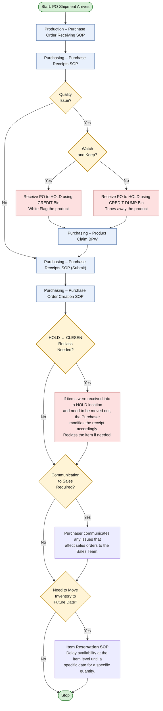

# Purchase Order Receiving

## Overview

For merchandise POs the Purchaser will update their POs with exemption notes before the shipment arrives. At receipt, all items are evaluated for quality and counted for accuracy at time of receipt by the Production team. Products out of spec are evaluated by the OM and AOM and either returned or held for credit or rehab. Day of pick needs are prioritized during the counting process. Any facility transfers are noted and coordinated.

A copy of the PO is submitted with verified counts and any details necessary to modify the PO, initiate a claim, or hold for future date. The AOM or Receiver will post the PO and assign bins for all items. If needed the purchaser will modify the PO and/or issue a Purchase Return Order, finalize the posting, and adjust in inventory for young plants. If a claim is required, the purchaser will initiate a credit request with the vendor. If extra grow time is required for the received product, an item reservation will be created.

## Process Diagram

## Process Details

### Production – Purchase Order Receiving SOP
AOM/Receiver prepares PO deck for submission:
- **PO is 'Full'** if counts match PO + vendor BOL, nothing returned, no quality issues
- **PO is 'Off'** if counts don't match, quality issue, or item arrives that is not on PO

Write 'Off' on PO, ensure all signatures present. Acknowledge received items on PO and BOL. Note returns in the body of PO and BOL. Tag kept-but-issue items: Keep & Delay, Credit Watch, or Credit Dump.

### Purchasing – Purchase Receipts SOP
AOM/Receiver retrieves and posts the PO in the Purchase Receipt workspace. If a location change is required on any line, contact the purchaser for the correction. Identify inventory bin for each item, post all lines at once. Split bins by quantity if needed.

### Purchasing – Product Claim BPW
Claim is made when BOL doesn't match counts or there is a quality issue. Revised invoice or credit memo reconciles the claim.

If product can't be sold, post on a Purchase Return Order created by Purchaser. Inventory and product can then be disposed or returned on the next truck.

Credit Watch on young plants → post inventory at $0.00 after the purchase return order.

### Purchasing – Purchase Receipts SOP (Submit)
Submit the purchase order. Highlight any item requiring PO changes for the purchaser to finalize.

Email paperwork for 'Off' POs ASAP with all relevant images for quality issues. 'Full' POs may be submitted by end of day.
Subject: 'POXX-XXXX Full' or 'POXX-XXXX Off' → PO Receiving distribution group.

### Purchasing – Purchase Order Creation SOP
Purchaser receives freight and service POs as needed. These POs are submitted to the PO distribution group with PO# and 'Full' in the subject line.

Purchaser modifies any 'Off' PO, adds/completes item charges, and performs the final receipt.

## Related SOPs

- Production – Purchase Order Receiving SOP
- [[purchase-receipt]] — Purchasing – Purchase Receipts workflow and system integration
- Purchasing – Purchase Order Creation SOP
- Growing – Crop Assessment SOP
- Purchasing – Item Reservations SOP

## Related BPWs

- Product Claim BPW

## Related Documentation

- [[purchase-receipt-system]] — Complete purchase receipt and vendor receiving system overview

## Version History

| Version | Date | Changes | Who |
|---|---|---|---|
| 5.0 | 2020-07-16 | Updated format, edited BPW (new SOPs), changed name from "Product Receiving" | Steve |
| 5.1 | 2020-07-23 | Updated flow chart for material POs, updated SOP names, changed location of claims in process | Steve |
| 5.2 | 2020-08-31 | Updated hyperlinks, formatted new diagram | Steve Hensley |
| 6.0 | 2020-11-01 | Updated for Nav, introduced inventory dept responsible for receiving and added into flow chart, updated overview | Steve Hensley |
| 7.0 | 2020-11-27 | Modified steps to include potential for journal entry if required to undo receipt | Steve Hensley |
| 8.0 | 2020-12-08 | Updated very complicated chart, added PO Creation SOP and link | Steve Hensley |
| 9.0 | 2020-12-08 | Added Reclass to put inventory on future date, updated overview | Steve Hensley |
| 10 | 2021-01-10 | Updated hyperlinks, revised diagram to correct future availability move, corrected Facility and Location uses, corrected pre-count receipt responsibility | Steve Hensley |
| 10.1 | 2021-01-10 | Corrected Pre-Count Receiving SOP to Receiving SOP | Steve Hensley |
| 11.0 | 2021-03-18 | Added responsibility of the ICS to receive all POs, changed Facility BPW ownership to Inventory | Steve Hensley |
| 12.0 | 2021-06-18 | Added new Ready Date Change BPW to address product that needs additional grow time after receipt | Steve Hensley |
| 13.0 | 2021-12-08 | Revised diagram for receipt instructions when a purchase return order is in play, added product claim BPW, removed Inventory and Purchasing SOPs that no longer apply | Steve Hensley |
| 14.0 | 2022-03-16 | Revised to accommodate claims process, updated hyperlink for operations SOP | Steve Hensley |
| 15.0 | 2022-03-31 | Revised diagram to address transfer prior to receiving, updated item charge posting responsibilities | Steve Hensley |
| 16.0 | 2022-09-11 | Removed Pre-Receiving steps, added item charge PO path to diagram, revised overview | Steve Hensley |
| 16.1 | 2023-06-08 | Added growers sign off for quality check on plant shipments | Steve Hensley |
| 17.0 | 2023-07-05 | Revised AOM responsibilities when receiving PO. Added Crop Assessment from growers if AOM requests due to quality. Revised overview | Steve Hensley |
| 18.0 | 2024-06-19 | Re-write to include extra steps during check in to address quality. Added handling of exemptions. All links updated. Operations renamed to Production. Added Facility Change BPW. Overview rewritten | Steve Hensley |
| 19 | 2025-08-13 | Updated entire diagram to include 2025 spring/summer notes and added AOM/Receiver posting responsibilities | Steve Hensley |
| 20 | 2026-03-26 | Updated diagram, added paths for young plant credits. Eliminated Freight POs, added item reservations | Steve Hensley |
